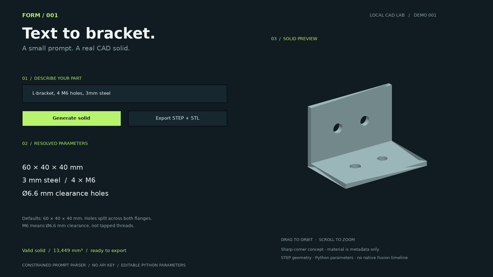

# X Demos

One working demo at a time: build it, test it, capture a short walkthrough, and share the code.



[Watch or download the 24-second demo video](assets/001-demo.mp4)

| Demo | What it does | State |
| --- | --- | --- |
| [001 — Text-to-Bracket](demos/001-text-to-bracket) | A constrained text prompt becomes an actual CAD solid, STEP and STL | Built and tested; video included |
| [002 — Sketch-to-3D](demos/002-sketch-to-3d) | A closed outline image becomes a CAD extrusion with editable depth and profile | Built and tested; video included |
| [003 — Drawing Auto-Dimension](demos/003-auto-dimension) | A stepped plate gets reference dimensions that update with its geometry | Built and tested; video included |
| [004 — Assembly-to-BOM](demos/004-assembly-to-bom) | A concept gripper becomes a grouped parts list with pack-aware sample costs | Built and tested; video included |

## Run demo 004

```sh
python demos/004-assembly-to-bom/studio.py
```

Explode the gripper, reveal its parts list, change the batch quantity and export CSV/JSON plus STEP. [Demo details and sample-pricing limits](demos/004-assembly-to-bom).

## Run demo 003

```sh
python demos/003-auto-dimension/studio.py
```

Add dimensions, change the plate width and export SVG/PNG plus editable JSON. [Demo details and limits](demos/003-auto-dimension).

## Run demo 002

After installing the dependencies below:

```sh
python demos/002-sketch-to-3d/studio.py
```

Open a sketch image, set width and depth, and export STEP/STL plus an editable JSON profile. Includes a synthetic sample sketch; supports simple closed outlines and planar extrusions. See the [demo README](demos/002-sketch-to-3d) for input constraints and CLI usage.

## Run demo 001

Python 3.11+ and a desktop environment are recommended. Dependency wheels must be available for your Python version and platform. The tested environment is macOS Intel with Python 3.14.

```sh
python3 -m venv .venv
source .venv/bin/activate
pip install -r requirements.txt
python demos/001-text-to-bracket/studio.py
```

For a headless command-line export:

```sh
python demos/001-text-to-bracket/bracket.py "L-bracket, 4 M6 holes, 3mm steel"
```

Outputs go into `outputs/bracket/`. Import `bracket.step` into Fusion or SolidWorks. The STEP file contains solid geometry; the editable parameter logic lives in the Python source and JSON, not a native CAD feature timeline.

## Verify and capture

```sh
python -m unittest discover -s demos/001-text-to-bracket -v
python demos/001-text-to-bracket/studio.py --preview outputs/001-preview.png
python demos/001-text-to-bracket/studio.py --record outputs/001-text-to-bracket.mp4
```

Video generation requires FFmpeg on PATH. It captures a 24-second, 1600×900, 24 fps walkthrough from the application's own rendered viewport. The scripted sequence invokes the same parser, solid generator and export actions as the interactive app. It is an application-rendered walkthrough, not a desktop screen recording or a timing benchmark.

All six automated checks passed, including STEP re-import and preventing stale exports after prompt edits. `requirements-lock.txt` captures the complete tested environment; `requirements.txt` pins the direct dependencies.

No account, API key, or paid CAD license is required to run this demo. See the demo README for the supported prompt grammar and model assumptions.
