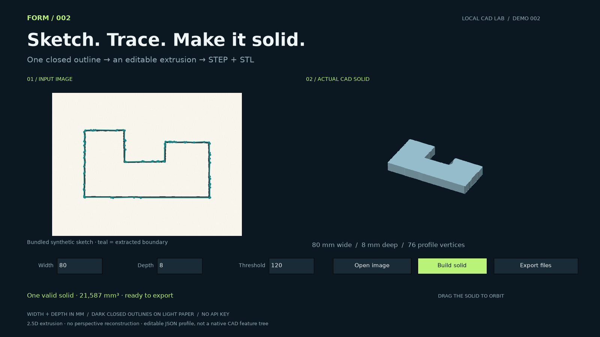

# 002 — Sketch-to-3D

A dark, closed outline on light paper becomes a real CAD extrusion. Open a PNG/JPEG, set its physical width and extrusion depth, inspect the solid, and export STEP, STL and an editable JSON profile.



[Watch the 22-second walkthrough](../../assets/002-demo.mp4)

## Run

From the repository root, using the environment described in the root README:

```sh
python demos/002-sketch-to-3d/studio.py
python demos/002-sketch-to-3d/studio.py path/to/sketch.jpg
```

Use **Open image** to select a file. Width and depth are in millimetres. **Threshold** controls which pixels count as ink; increase it for lighter lines, decrease it for darker backgrounds. Press Enter or **Build solid** after editing. Drag to orbit and use **Export files** to save into `outputs/sketch-to-3d/`.

For headless use:

```sh
python demos/002-sketch-to-3d/sketch.py path/to/sketch.jpg --width 80 --depth 8
python demos/002-sketch-to-3d/sketch.py --rebuild outputs/sketch-to-3d/profile.json --depth 24 --output outputs/sketch-deeper
```

Run without an image argument to use the bundled synthetic sketch. Edit `vertices_mm` or `depth_mm` in `profile.json`, then use `--rebuild` to regenerate. The source image is actually traced; its coordinates are not replaced with a prebuilt part.

## Input constraints

- One connected, closed, unfilled outline with a light border. No text, dimensions, holes, hatching, intersecting strokes or multiple parts.
- Use a tightly cropped, evenly lit, front-on image. A suitable phone photo can be supplied, but perspective, shadows and lens distortion are not corrected. No phone photographs have been validated in the bundled demonstration.
- PNG/JPEG/WebP input is resized to at most 1000 pixels per side. Physical scale comes from the width you enter; it is not inferred from the photo.
- The outer edge of the ink stroke is traced and simplified at 1.5 pixels. Sketch irregularities remain; this is approximate outline capture, not precision drawing reconstruction.
- The result is a 2.5D extrusion of a planar polygon. The program does not infer unseen surfaces, bends, assemblies or arbitrary 3D objects.
- Editable parameters live in Python/JSON. STEP contains boundary-representation geometry, not a native Fusion/SolidWorks sketch or feature history.

## Verification and recording

```sh
python -m unittest discover -s demos/002-sketch-to-3d -v
python demos/002-sketch-to-3d/studio.py --preview assets/002-sketch-to-3d.png
python demos/002-sketch-to-3d/studio.py --record outputs/002-demo.mp4
```

The tests check dimensions, volume, concavity, depth edits, rejection of unsupported inputs, STEP re-import, JSON rebuilds and stale-export prevention. Recording requires FFmpeg and captures the application's own 1600×900 viewport at 24 fps. It is a scripted application-rendered walkthrough, not a desktop recording or timing benchmark. `make_sample.py` produces the bundled synthetic sketch fixture; it is not a phone photo.

## Implementation and references

`sketch.py` thresholds the image, finds the single connected ink component, fills its enclosed region, extracts a contour, simplifies it and extrudes it with build123d. `studio.py` provides the viewer and recorder. No model, API key or paid CAD license is used.

- [SciPy region filling](https://docs.scipy.org/doc/scipy/reference/generated/scipy.ndimage.binary_fill_holes.html)
- [build123d polygons and extrusion](https://build123d.readthedocs.io/en/stable/objects.html)

## Publishing

Use `post.txt` with `assets/002-demo.mp4`. The post describes the demonstrated outline-to-extrusion workflow and identifies the synthetic input.
