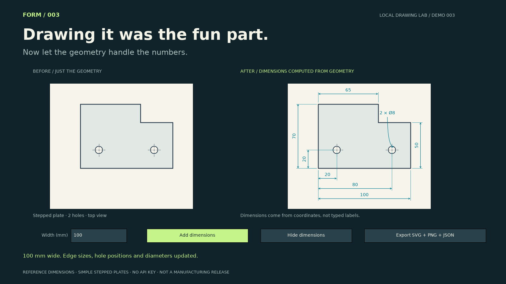

# 003 — Drawing Auto-Dimension

Drawing the part is fun. Adding every dimension is less fun.

This demo takes a stepped plate defined in JSON, displays the bare geometry and automatically annotates its overall size, step location, hole centers and hole diameter. Change the width from 100 to 120 mm: the right hole moves from x=80 to x=100, keeping its 20 mm edge inset, and the dimensions update with it.



[Watch the 20-second demo](../../assets/003-demo.mp4)

## Run

Use the repository's Python environment and dependencies:

```sh
python demos/003-auto-dimension/studio.py
```

Click **Add dimensions**. Change **Width (mm)** and press Enter. **Hide dimensions** returns to the unannotated view. **Export SVG + PNG + JSON** writes a standalone drawing, the editable geometry and computed measurements into `outputs/auto-dimension/`.

Edit `plate.json` to change the height, step, hole size and positions. Load a different file with:

```sh
python demos/003-auto-dimension/studio.py path/to/plate.json
python demos/003-auto-dimension/drawing.py path/to/plate.json --output outputs/my-drawing
```

The command-line exporter runs without a desktop. Both interfaces use the same geometry, dimension computation and renderer. SVG is a vector drawing; it is not a DXF file or native CAD document.

## Scope

- Supports this six-vertex, axis-aligned stepped plate with two equal circular holes. JSON describes geometry in millimetres; it does not contain prewritten dimension labels.
- Dimensions are nominal references derived from the input geometry. Overall size, step coordinates, hole center coordinates and diameter are included. Both hole centers share one y coordinate.
- Geometry is validated to keep holes separated and within the plate. The supported size envelope is width 50–180 mm and height 40–100 mm, with additional checks for the step and holes.
- The automatic layout is demonstrated on the bundled geometry at 100 and 120 mm widths. Extreme combinations may require manual label adjustment in an SVG editor.
- Does not import arbitrary CAD drawings, infer geometry from photographs, or apply GD&T, tolerances, material, thickness, surface finish or process requirements.
- This is **not an ISO-compliance claim or a manufacturing-ready drawing**. The tracker idea is implemented here as a bounded reference-dimensioning prototype.

No AI model, API key or paid CAD license is required.

## Tests and video

```sh
python -m unittest discover -s demos/003-auto-dimension -v
python demos/003-auto-dimension/studio.py --preview assets/003-auto-dimension.png
python demos/003-auto-dimension/studio.py --record outputs/003-demo.mp4
```

Tests cover geometry-derived measurements, width changes, invalid geometry, SVG parsing, JSON round-trip and export after unsubmitted edits. The MP4 is a 20-second, 1600×900, 24 fps application-rendered walkthrough with staged annotation reveal. It is not a desktop capture or a speed benchmark. Recording requires FFmpeg.

The `drawing.py` module computes and renders dimensions using [Matplotlib annotations](https://matplotlib.org/stable/api/_as_gen/matplotlib.pyplot.annotate.html). `studio.py` provides the interactive comparison and recorder.

## Post

Use `post.txt` with `assets/003-demo.mp4`. The hook focuses on the repetitive drawing work, followed by the actual geometry-edit payoff.
