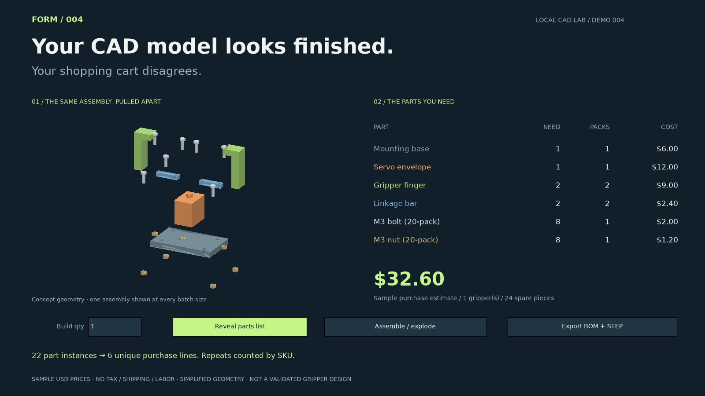

# 004 — Assembly-to-BOM

Your CAD model looks finished. Your shopping cart disagrees.

A concept robot gripper contains 22 component instances but only six unique catalog items. This demo traverses its assembly tree, groups repeated parts by SKU and calculates a pack-aware purchase estimate. Switch from one gripper to ten and the quantities, pack counts, spares and costs update together.



[Watch the 24-second walkthrough](../../assets/004-demo.mp4)

## Run

Use the Python environment and dependencies in the repository root:

```sh
python demos/004-assembly-to-bom/studio.py
```

Click **Reveal parts list**, edit **Build qty** and press Enter. **Assemble / explode** toggles the 3D view. **Export BOM + STEP** writes `bom.csv`, `bom.json` and `gripper.step` into `outputs/assembly-bom/`. The view and STEP always represent one gripper; the BOM scales to the selected batch.

Headless BOM export:

```sh
python demos/004-assembly-to-bom/bom.py --batch 10
```

Edit `assembly.json` to change instances or groups. Every instance has a unique ID, a SKU, a position, a rotation and an exploded-view displacement. `catalog.json` supplies names, pack sizes and sample pack prices in integer US cents. Both the CAD model and BOM use the same assembly tree.

```sh
python demos/004-assembly-to-bom/studio.py --assembly path/to/assembly.json --catalog path/to/catalog.json
python demos/004-assembly-to-bom/bom.py --assembly path/to/assembly.json --catalog path/to/catalog.json --batch 10
```

## What makes the estimate different

For one gripper, eight bolts require one 20-pack, leaving 12 spares. The nuts work the same way. At ten grippers, 80 bolts and 80 nuts require four packs each, with no spare fasteners. The sample purchase estimates are **$32.60 for one** and **$306.80 for ten**. Integer arithmetic calculates pack counts and money; no fractional packs are purchased.

Every CSV row and the JSON report identify the prices as synthetic. The six sample line items are a base, a servo envelope, fingers, linkage bars, bolts and nuts.

## Boundaries

- All prices are invented examples in USD, not live supplier prices or quotes. Taxes, shipping, labor and tooling are excluded. No order is placed and no supplier availability is claimed.
- This prototype imports an explicit JSON assembly tree, not arbitrary STEP or native CAD files. The built-in geometry library supports the six component types shown here.
- Components are simplified CAD solids, including an envelope for the servo and unthreaded bolt/nut representations. The concept assembly has not been checked for collisions, kinematics, loads, tolerances, actuation or manufacturability. It is not a build-ready robot design.
- “Six purchase lines” means six SKUs. Repeated instances contribute quantities; geometric similarity alone does not merge different SKUs.
- The STEP file contains labeled component solids for one assembled gripper. JSON retains BOM/catalog metadata. Purchased inventory and supplier identities are not inferred from geometry.
- Batch size is 1–1000; assembly trees allow up to 500 instances and 20 levels. Group transforms are not supported; instance coordinates are absolute millimetres.

## Verification and recording

```sh
python -m unittest discover -s demos/004-assembly-to-bom -v
python demos/004-assembly-to-bom/studio.py --preview assets/004-assembly-to-bom.png
python demos/004-assembly-to-bom/studio.py --record outputs/004-demo.mp4
```

Tests check nested quantities, changes in instances and catalog prices, pack rounding, money totals, invalid inputs, CSV/JSON export, all 22 component solids in a STEP round-trip and export after unsubmitted batch edits.

The video is a scripted, application-rendered 24-second walkthrough at 1600×900 and 24 fps. It animates an exploded view, reveals the computed BOM, changes the batch size and invokes the real exporter. It is not a desktop recording or a performance benchmark. FFmpeg is required for recording. No model, API key or paid CAD license is required.

`make_sample.py` regenerates the included assembly instance tree. The scene is built using [build123d assemblies](https://build123d.readthedocs.io/en/latest/assemblies.html) and [STEP export](https://build123d.readthedocs.io/en/stable/import_export.html).

## Post

Use `post.txt` with `assets/004-demo.mp4`. The post identifies the gripper as a concept and the prices as samples.
